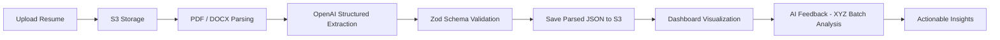

This is a [Next.js](https://nextjs.org) project bootstrapped with [`create-next-app`](https://nextjs.org/docs/app/api-reference/cli/create-next-app).

## Getting Started
## Environment Setup

This app uses AWS S3 (uploads, resume, preferences, matched courses) and Clerk for auth. Create a `.env.local` at the repo root (copy from `.env.example`) and fill in the required values:

Required variables:
- `AWS_BUCKET_NAME`: Your S3 bucket name
- `AWS_BUCKET_REGION`: Bucket region (e.g., `us-east-1`)
- `IAM_AWS_ACCESS_KEY`: IAM Access Key ID with Put/Get/Delete access to the bucket
- `IAM_AWS_SECRET_ACCESS_KEY`: IAM Secret Access Key
- `NEXT_PUBLIC_CLERK_PUBLISHABLE_KEY`: Clerk publishable key
- `CLERK_SECRET_KEY`: Clerk secret key

On Windows PowerShell, you can scaffold a `.env.local` like this and then edit it:

```powershell
Copy-Item .env.example .env.local -Force
notepad .env.local
```

After updating env vars, restart the dev server so the API routes pick them up.

First, run the development server:

```bash
npm run dev
# or
yarn dev
# or
pnpm dev
# or
bun dev
```

Open [http://localhost:3000](http://localhost:3000) with your browser to see the result.

You can start editing the page by modifying `app/page.tsx`. The page auto-updates as you edit the file.

This project uses [`next/font`](https://nextjs.org/docs/app/building-your-application/optimizing/fonts) to automatically optimize and load [Geist](https://vercel.com/font), a new font family for Vercel.

## Learn More

To learn more about Next.js, take a look at the following resources:

- [Next.js Documentation](https://nextjs.org/docs) - learn about Next.js features and API.
- [Learn Next.js](https://nextjs.org/learn) - an interactive Next.js tutorial.

You can check out [the Next.js GitHub repository](https://github.com/vercel/next.js) - your feedback and contributions are welcome!

## Deploy on Vercel

The easiest way to deploy your Next.js app is to use the [Vercel Platform](https://vercel.com/new?utm_medium=default-template&filter=next.js&utm_source=create-next-app&utm_campaign=create-next-app-readme) from the creators of Next.js.

Check out our [Next.js deployment documentation](https://nextjs.org/docs/app/building-your-application/deploying) for more details.


# Grasshopper Labs — Project Overview

## What It Is

A **resume analysis and optimization platform** for college students seeking internships and entry-level tech roles. Students upload their resume (PDF/DOCX), and the app provides an interactive dashboard with AI-powered insights, scoring, skill gap analysis, and coursework alignment — all tailored to their target roles.

---

## Core User Flow



1. **Sign Up / Sign In** — Clerk handles authentication (Google, GitHub, email/password)
2. **Questionnaire** — Students select target roles (e.g. "Full Stack Developer"), tech sectors, and preferences
3. **Upload Resume** — Drag-and-drop upload (PDF, DOCX, TXT). Stored in AWS S3 under user-specific paths
4. **AI Parsing** — Raw text extracted via `pdf-parse` / `mammoth`, then sent to **OpenAI (GPT)** with a structured Zod schema prompt to extract: basics, education, skills, projects, experience, certifications, etc.
5. **Dashboard** — Multi-tab visualization of parsed data with scoring, charts, and actionable feedback
6. **Profile / Editor** — Inline resume editor to tweak parsed data directly, plus submission history with restore functionality

---

## Tech Stack

| Layer | Technology |
|---|---|
| **Framework** | Next.js 15.5 (App Router, Turbopack) |
| **Language** | TypeScript |
| **UI Library** | React 19 |
| **Styling** | Tailwind CSS 4, tw-animate-css |
| **Component Library** | Radix UI (Dialog, Tabs, Accordion, Dropdown, etc.) + shadcn/ui patterns |
| **Charts** | Recharts (Radar, Area, Pie charts) |
| **Icons** | Lucide React |
| **Authentication** | Clerk (OAuth + email, session management) |
| **Cloud Storage** | AWS S3 (resume files, parsed JSON data, feedback cache) |
| **AI / LLM** | OpenAI API (GPT) — structured output with Zod schemas |
| **Validation** | Zod (schema validation for parsed resume data) |
| **Database (planned)** | Drizzle ORM (present in deps) |
| **PDF Parsing** | pdf-parse (PDFs), mammoth (DOCX) |
| **Hosting** | Vercel |
| **Forms** | React Hook Form + Zod resolvers |
| **Notifications** | Sonner (toast notifications) |

---

## Architecture Overview

```
src/
├── app/
│   ├── page.tsx                    # Landing / Upload page
│   ├── dashboard/page.tsx          # Main analytics dashboard (2100+ lines)
│   ├── profile/page.tsx            # Profile, editor, history, statistics
│   ├── questionnaire/              # Role & preference selection
│   ├── about-us/                   # Team page
│   ├── api/
│   │   ├── upload/                 # POST: File upload → S3 (daily limit: 3/day)
│   │   ├── parse/                  # POST: S3 file → text extraction → OpenAI → structured JSON
│   │   │   ├── resumeSchema.ts     # Zod schema defining the Resume type
│   │   │   ├── semanticParse.ts    # OpenAI GPT integration
│   │   │   └── parseContent.ts     # PDF/DOCX text extraction
│   │   ├── resume/                 # GET/POST: Read/write parsed resume JSON
│   │   ├── resume-submissions/     # GET/POST/DELETE: Submission history (last 10)
│   │   │   └── restore/            # POST: Restore a previous resume version
│   │   ├── resume-preview/         # GET: Presigned S3 URL for PDF preview
│   │   ├── analyze/
│   │   │   ├── xyz-batch/          # GET/POST: AI quality analysis (XYZ scoring)
│   │   │   ├── xyz/                # Single-item XYZ analysis
│   │   │   └── insights/           # AI-generated actionable insights
│   │   ├── match-coursework/       # POST: Match resume courses to UF catalog
│   │   ├── preferences/            # GET/POST: User questionnaire preferences
│   │   ├── insights/               # Insights schema definitions
│   │   └── uf-courses/             # GET: University course catalog data
│   └── sign-in/ & sign-up/        # Clerk auth pages
│
├── components/
│   ├── resume-upload.tsx           # Drag-and-drop upload with progress
│   ├── gpa-progress-bar.tsx        # GPA visualization with internship benchmark
│   ├── career-path-radar.tsx       # Coursework alignment radar chart
│   ├── actionable-insights.tsx     # AI-generated checklist of improvements
│   ├── xyz-inline-feedback.tsx     # Inline XYZ quality scores on projects/experience
│   ├── role-skills-match.tsx       # Skills gap analysis vs target roles
│   ├── resume-verification.tsx     # Resume data verification/review
│   ├── student-preferences.tsx     # Questionnaire component
│   ├── header.tsx                  # Navigation header with auth
│   └── profile/resume-editor.tsx   # Inline resume data editor
│
├── contexts/
│   └── resume-context.tsx          # Global state: resume data, feedback, preferences
│
└── lib/
    ├── aws/s3.ts                   # S3 utilities (upload, download, presign, list, delete)
    ├── resumeScoring.ts            # Weighted scoring algorithm (quality + quantity)
    ├── qualityAnalysis.ts          # AI-driven quality metrics
    └── courseMatching.ts           # Course catalog matching logic
```

---

## Key Features

### 1. Resume Parsing Pipeline
- Accepts PDF, DOCX, TXT uploads (max 10MB)
- Text extracted server-side (`pdf-parse`, `mammoth`)
- Sent to **OpenAI GPT** with a strict Zod schema prompt
- Returns structured JSON: basics, education, skills, projects, experience, certifications, publications, extracurriculars

### 2. Dashboard (Multi-Tab)
| Tab | Components |
|---|---|
| **Overall** | Resume Score (weighted), Actionable Insights |
| **Education** | GPA Progress Bar (benchmark: 3.3 avg internship), Year-in-School Indicator, Career Path Coursework Radar |
| **Experience** | Experience Summary, Role-Skills Match, XYZ Inline Feedback |
| **Projects** | Project Portfolio Summary, Skills Radar Chart, XYZ Inline Feedback |

### 3. AI-Powered Scoring
- **Resume Score** (0-100): Weighted across 6 categories — Projects, Experience, Skills, Links+Contact, GPA, Coursework
- **XYZ Analysis**: Each project/experience bullet is scored on the "Accomplished [X] by doing [Y], resulting in [Z]" framework
- **Actionable Insights**: AI-generated checklist (high/low priority) with specific improvement suggestions

### 4. Coursework Matching
- Matches resume courses against the **UF course catalog**
- Groups courses by CS discipline (Systems, AI/ML, Software Engineering, etc.)
- Visualized as a radar chart showing coverage across career-relevant areas

### 5. Profile & History
- **Resume Editor**: Edit parsed resume data fields inline
- **Submission History**: Last 10 uploads preserved, any can be restored
- **Statistics Tab**: Score evolution chart, average/best/current scores
- **AI Feedback Toggle**: Show/hide XYZ feedback globally

### 6. Preferences / Questionnaire
- Target role types (Frontend, Backend, ML, DevOps, etc.)
- Tech sectors of interest
- Stored server-side, used to personalize skill recommendations

---

## Data Flow

```
User's Browser
   │
   ├── Upload PDF ──→ POST /api/upload ──→ AWS S3
   │                                        │
   ├── Parse ────────→ POST /api/parse ──→ pdf-parse → OpenAI GPT → Zod Validation
   │                                        │
   │                                   PUT resume-data.json → S3
   │
   ├── Dashboard ────→ GET /api/resume ──→ S3 → resume-data.json
   │
   ├── AI Feedback ──→ POST /api/analyze/xyz-batch ──→ OpenAI GPT
   │                                        │
   │                                   PUT xyz-feedback.json → S3
   │
   └── Coursework ──→ POST /api/match-coursework ──→ courseMatching.ts
```

All persistent data lives in **AWS S3** as JSON files, keyed by user ID. No traditional database is used for resume data (Drizzle ORM is in deps for future use).

---

## Deployment

- **Hosting**: Vercel (auto-deploys from GitHub `main` branch)
- **Environment Variables**: Clerk keys, AWS credentials (IAM), OpenAI API key
- **Build**: `next build --turbopack`
- **Branching**: `main` (production), `develop` (staging)

---

## Rate Limits & Guardrails

- **3 uploads/day** per user (exemptions possible)
- **10MB** max file size
- **Last 10** submissions retained (older ones auto-pruned from S3)
- Restoring a resume does **not** count as a new submission in statistics